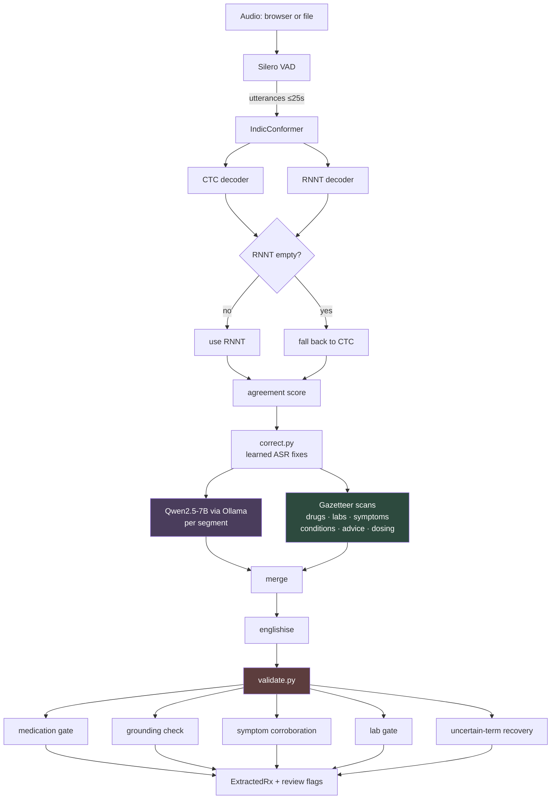
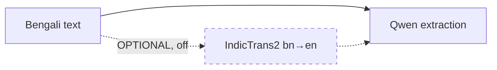
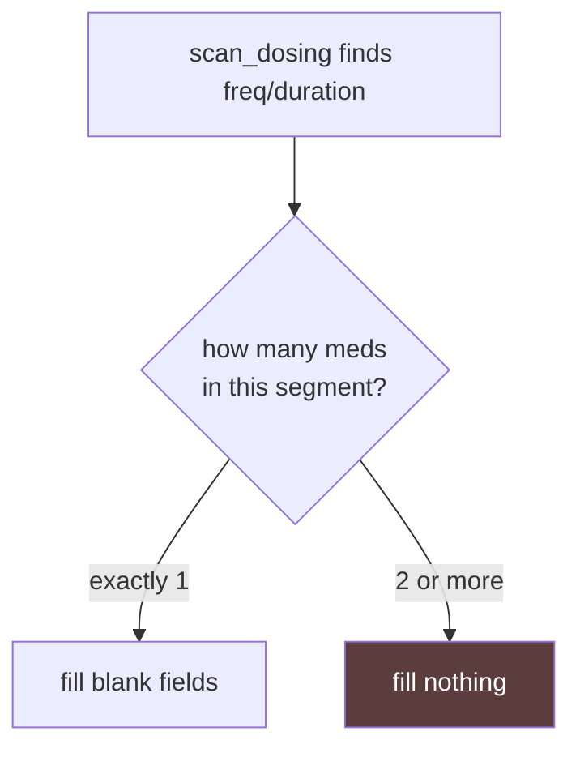
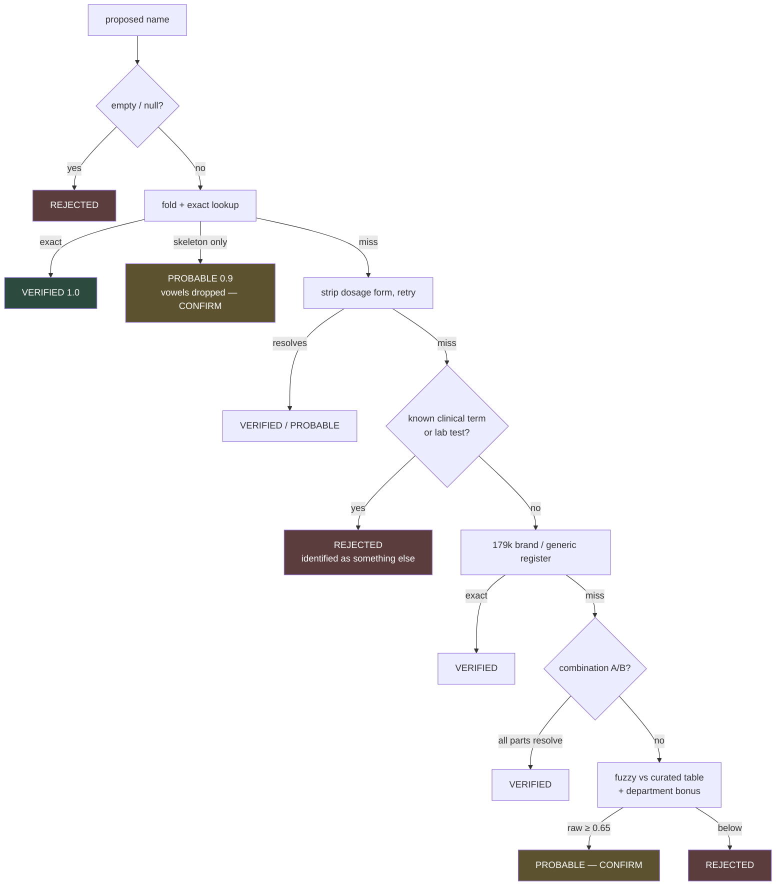
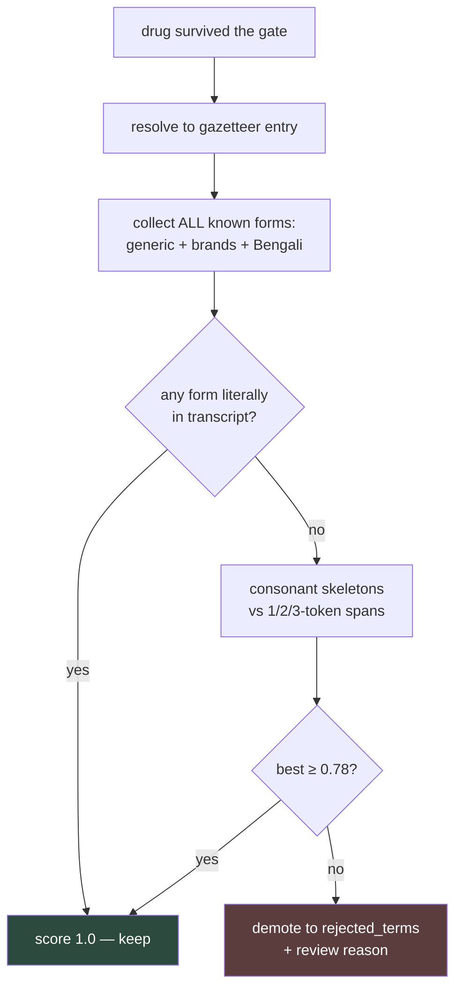
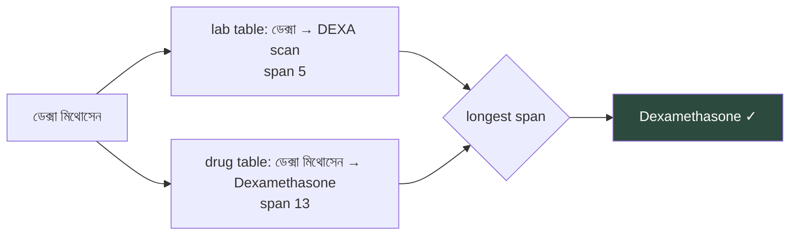
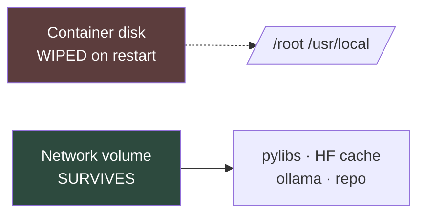

# Voice-to-Rx — Design & Implementation Guide

Bengali doctor–patient consultation → structured prescription.

This document explains **what the system does, why each part is built the way
it is, and what the alternatives cost**. Every threshold and rule here traces
to a specific observed failure on real consultations; where a number was
measured, the measurement is shown, and where it rests on thin evidence, that
is stated rather than hidden.

---

## Table of contents

1. [The problem](#1-the-problem)
2. [Governing principle](#2-governing-principle)
3. [Architecture](#3-architecture)
4. [Node 1 — Segmentation and ASR](#4-node-1--segmentation-and-asr)
5. [Node 2 — Extraction](#5-node-2--extraction)
6. [Node 2.5 — Gazetteer recovery](#6-node-25--gazetteer-recovery)
7. [Node 3 — Gate and validation](#7-node-3--gate-and-validation)
8. [The gazetteer](#8-the-gazetteer)
9. [Thresholds and their provenance](#9-thresholds-and-their-provenance)
10. [Decision log](#10-decision-log)
11. [Failure modes](#11-failure-modes)
12. [Implementation guide](#12-implementation-guide)
13. [Testing](#13-testing)
14. [Deployment](#14-deployment)

---

## 1. The problem

A doctor speaks Bengali. The output must be a prescription a pharmacist can
fill. Three properties make this different from ordinary speech-to-text:

**It is safety-critical in one specific direction.** A missing drug prompts a
question. A *wrong* drug does not — it reads as a decision. The system is
therefore built so that every uncertainty produces a visible blank or a flag,
never a confident-looking guess.

**Drug names are the highest-risk field and the worst-recognised one.** Bengali
ASR garbles transliterated brand names badly. `রসু ভাস্টাটিন` (Rosuvastatin) is
split across words; `মন ডেগুলাস্ট` is Montelukast at 0.70 similarity. These are
not edge cases — they are the normal condition of the input.

**The answer set is closed.** "Is this a drug?" is enumerable. That single fact
is what the whole design leans on.

### The failure that defines the system

An early version turned a garbled fragment into **"Naloxone"** — a real drug,
wrong patient. Later, **"Erythromycin"** was printed on a urology prescription
that never mentions it: the model invented the name, and the gate verified it
against a 179,002-entry imported brand register, so a fabrication arrived
wearing the same badge as a drug the doctor actually said.

Both are the same class of error: **a specific, plausible, wrong name presented
with confidence.** Everything below exists to make that outcome structurally
difficult.

---

## 2. Governing principle

> **The model proposes. The gazetteer decides. A human disposes.**

The LLM is good at reading narrative and bad at closed-set recall under garble.
The gazetteer is the opposite. So they are split by what each is actually good
at, and neither is trusted to check itself.

Three corollaries run through every module:

| Rule | Meaning |
|---|---|
| **Nothing is ever silently discarded** | Rejected terms go to `rejected_terms`, uncertain ones to `raw_uncertain_terms`, unconfirmed symptoms to `symptoms_unconfirmed`. A reviewer can always see what was removed and why. |
| **Nothing uncertain is ever silently applied** | A resolution below certainty stays a *proposal*: `verified=False`, `review_reason` set, `heard_as` preserving the original. |
| **Context reorders candidates; it never lowers the bar** | Knowing the specialty decides *which* real drug a garble is. It can never decide *whether* a garble is a drug. |

---

## 3. Architecture



**Two independent paths reach the output.** The LLM path (purple) reads
narrative. The gazetteer path (green) reads the same Bengali text
deterministically. They are **merged, not substituted** — so anything either one
catches survives, and the validation layer (red) then judges the union.

That redundancy is deliberate. The LLM missed *every* lab order across ten
consultations while the gazetteer found `CBC` inside the ASR's mangled
`সি ভিসিটা`. Conversely the gazetteer cannot read narrative dosing like
`দুপুরে খাওয়ার পর`. Neither alone is sufficient.

### Live vs. optional



`server.py:56` builds `VoiceToRxPipeline()` with **no translator**.
`pipeline.py:36`: `translator=None` "keeps the Bengali-only path that was
actually verified." The bn→en bridge is implemented and staged but awaits an
A/B on the same audio. Qwen extracts from Bengali today.

---

## 4. Node 1 — Segmentation and ASR

### 4.1 Why segment before ASR

Two independent failures both point at long audio:

1. **RNNT silently drops content.** Frame-level alignment showed zero non-blank
   tokens for the first 78% of a 49-second file. Slicing the same audio and
   re-running decoded it correctly — proving a *sequence-length* bug, not a
   model-quality one.
2. **Long context increases hallucination.** A run-on 49-second block produced
   an invented symptom *and* an invented drug name. The same content, isolated,
   did not.

Segmenting fixes both causes at once. Silero VAD, `max_segment_s=25.0`,
`merge_gap_s=0.6` — the merge gap keeps `"um... four or five times"` as one
utterance instead of three fragments.

### 4.2 Dual decoder

CTC and RNNT share an encoder but decode independently.

| | Pros | Cons |
|---|---|---|
| **RNNT only** | More accurate on real segments; correctly split `চার্জিনারস` → `চার্জ নার্স` | Returns empty on ~3.5% of segments (2/57, both ≤3.1s) |
| **CTC only** | Never empty; no length ceiling | Less accurate on the same audio |
| **Both (chosen)** | RNNT quality + CTC safety net, **plus a free disagreement signal** | Doubles ASR compute |

The third benefit is the one that justifies the cost. **Decoder agreement is a
confidence signal neither decoder can produce alone**, computed as Jaccard
overlap of word sets:

```
agreement = |words(ctc) ∩ words(rnnt)| / |words(ctc) ∪ words(rnnt)|
```

Real data: the segment that produced hallucinated eye symptoms scored **0.29**;
the median segment scored **0.56**. Below `LOW_AGREEMENT = 0.5`, the decoders
could not agree what was *said*, so anything built on top is speculation — and
`validate.py` demotes symptoms from such segments.

ASR cost is ~2 s/consultation against ~43 s for extraction, so doubling it is
not the bottleneck.

---

## 5. Node 2 — Extraction

Qwen2.5-7B over Ollama, **per segment**, temperature 0.

### Why per-segment rather than whole-transcript

| | Pros | Cons |
|---|---|---|
| **Whole transcript** | Model sees full context; can link symptom→diagnosis | Reproduced hallucination; one failure loses everything |
| **Per segment (chosen)** | Small grounded context; a failure costs one segment | Cross-segment reasoning lost; N× LLM calls |

The prompt encodes the lessons as hard rules — grounding (rule 1), never
resolving garble into a drug name (rule 2, carrying the Naloxone example
verbatim), report every stated symptom (3b), and record route/instructions
(3c). Rule 3b exists because the opposite over-correction appeared: on a cardiac
consultation, sweating, palpitations and breathlessness were all spoken and all
omitted, losing the three findings that make the diagnosis.

**Extraction failures never drop a segment.** A placeholder `ExtractedRx` is
emitted with `confidence_note="EXTRACTION FAILED - transcript preserved, not
interpreted"`. Silent drops previously lost real content *and* misaligned
`segments[]` against `extractions[]` for every caller that zips them.

---

## 6. Node 2.5 — Gazetteer recovery

Six scanners read the corrected Bengali directly and merge into the LLM's
output: `scan_labs`, `scan_drugs_spoken`, `scan_symptoms`, `scan_conditions`,
`scan_advice`, `scan_dosing`.

Each was added for a specific measured loss:

| Scanner | The failure it closes |
|---|---|
| `scan_labs` | LLM missed **every** lab order in 10 consultations |
| `scan_drugs_spoken` | `মেট ফর্মিন`, `রসু ভাস্টাটিন`, `মেটো প্রোল` sat in the transcript, absent from `medications[]` |
| `scan_symptoms` | — |
| `scan_conditions` | Cataract transcribed perfectly, recognised, and still returned a blank diagnosis — nothing carried it to an output field |
| `scan_advice` | Advice was understood, then dropped because the schema had nowhere to put it |
| `scan_dosing` | `দুপুরে খাওয়ার পর` returned blank — the model expects clinical shorthand |

**`scan_drugs_spoken`, not `scan_drugs`.** The brand the doctor named must
survive. Scanning for the generic is what put "Nitroglycerin" on a prescription
where the spoken word was `সরবিট্রেট` (Sorbitrate).

### The single-medication dosing rule



A segment's timing is a *segment* fact; attributing it to a particular drug is a
guess. Copying it to every drug made that guess silently, several times over —
and produced a clinically wrong instruction on a real cardiology consultation:

> `রোজ সকালে খাওয়ার পর ... ইকোস্পিডিন আর রসু ভাস্টা টিন ... আর বুকে ব্যাথা উঠলে ... জিভের তলায় একটা সর্বিট্রেট`

One sentence, two schedules: a daily tablet and an as-needed sublingual.
"After breakfast" was copied onto the Sorbitrate, **which is taken when the pain
starts**. A patient following that takes it at breakfast and has none during
angina. With several drugs present, the model's own attribution is the only one
with sentence structure to go on — so nothing is filled in behind it. A blank
prompts a question; a wrong schedule does not.

---

## 7. Node 3 — Gate and validation

### 7.1 The medication gate



**Order matters, and it used to be wrong.** The clinical-term/lab check sat
*after* the brand register, so `electrolytes` — a lab test — matched some
product in the register and came back VERIFIED as a medication. Found on a
500-transcript dry run, **firing 227 times**. The rule now: **curated beats
imported**.

**Dosage forms come off before judging.** `অ্যাম্ব্রুডিল সিরাপ` matched the
non-clinical term "syrup" and the whole drug was demoted, though
`অ্যাম্ব্রুডিল` alone resolves perfectly. The form must not become a verdict
about the name.

**The 179k register is validation-only, never used to scan free text.** Fishing
179,000 names out of a raw transcript would be a different and far more
dangerous operation — many are ordinary words, and a "hair loss → Lactulose"
failure would return at scale.

### 7.2 Why three tiers

A strict allowlist was tested: it correctly rejected 13 of 18 false positives
but also discarded `Montuculast` and `মন ডেগুলাস্ট`, both real Montelukast
prescriptions. PROBABLE exists for exactly those — kept, never silently
rewritten.

### 7.3 The grounding check

The gate answers *"is this a real drug?"* — a fabrication passes that easily.
The grounding check asks the question the gate cannot: **"was this one said?"**



**Checking the model's raw string against the transcript does not work, and was
measured failing** — garbled-but-real names score no better than invented ones.
`Colonsalicyl` is a *true* reading of `কোলন স্যালেসাইল` at 0.80, while the bogus
`Traject` scores 0.89 against an unrelated word. No threshold separates them.

What separates them is scoring every **known form of the resolved drug**:

| Score | Drug | Verdict |
|---|---|---|
| 0.62 | Lignocaine+Hydrocortisone | not said |
| 0.67 | Erythromycin | not said |
| 0.75 | Linagliptin | not said |
| — | — | **gap** |
| 0.80 | Ecosprin | said as ইকোস্পিডিন |
| 0.80 | Norethisterone | said as ট্রিমোলাট |
| 0.82 | Choline Salicylate | said as কোলন স্যালেসাইল |
| 0.89+ | everything else | said |

Cross-script matching is why skeletons are needed: the model romanises what the
ASR wrote in Bengali, so the two never meet under `fold()`.

### 7.4 Department clash

A fuzzy match that also lands in the wrong specialty is demoted. On a menopause
consultation, `Traject` resolved by edit distance alone to **Linagliptin**, a
diabetes drug. Grounding could not separate it (see above); specialty could —
clearing Trimolat, ট্রাফিক, অ্যামোরাল, Adapaline, Colonsalicyl and Montuculast
while catching only Traject and Roxatodil.

Both sides must be *specific*: "general" drugs (paracetamol, antacids) are
prescribed in every clinic, so they never clash.

### 7.5 Uncertain-term recovery

The model files doubt into `raw_uncertain_terms`, and nothing ever looked at it
again. Measured: `অ্যামোরাল (possible medication name, ASR unclear)` — the gate
resolves it to **Glimepiride** at 0.75, and Glimepiride alongside the Metformin
in the same sentence is the standard pairing. The drug was recoverable the whole
time.

**The model's doubt is not a verdict.** It is a reason to check, not to discard.
Recoveries land as PROBABLE at best and are always flagged.

### 7.6 Dosing is normalised, never resolved

`"One Eightti EMI Tab Five Days"` is plainly `180 mg tab, 5 days`. The system
**does not** convert it — that would invent a specific dose from garble, in the
one field where a tenfold error is unrecoverable by a reader who trusts the
number. The text is kept as heard and the row flagged. A doctor reads "as heard"
and types the dose: a five-second correction. A confidently wrong "18 mg" is not
a correction at all, because nothing signals it is wrong.

---

## 8. The gazetteer

### 8.1 `fold()` — phonetic normalisation

Normalises consonants, spacing, half-letters and dialect. **It deliberately does
not strip vowels** — that was tried and rejected, because it collapses distinct
drugs onto each other.

### 8.2 `_skeleton()` — consonant-only

Vowels dropped. Used for cross-script pairing and for ASR vowel drift, behind an
**exact** index (`_DRUG_SKELETON`, 959 entries; 11 of 962 ambiguous ones
excluded). A skeleton hit resolves as **PROBABLE, never VERIFIED** — real enough
to keep, not certain enough to assert.

### 8.3 Cross-table arbitration

Each table used to scan the same text independently, so the lab table pulled
`ডেক্সা` out of `ডেক্সা মিথোসেন` (Dexamethasone) — recording a **bone-density
scan** for an allergy patient given a steroid injection.

`_drop_overlapped()` resolves this: **longest span wins**, across tables and
within the drug table.



Subsumption follows the same logic: MRI → MRI brain, infection → stomach
infection, Vitamin B → B12.

### 8.4 Integrity invariants

- **`collisions() == 0`** — no two entries may fold to the same key. Enforced by test.
- **`_AMBIGUOUS_WITH_COMMON_WORD`** — `গা`, `কসট`, `বরন`, `কাটা` are blocked from generating keys; they are ordinary Bengali words. Inflected forms fold to distinct keys and *are* allowed, which is how acne stayed diagnosable after `বরন` was blocked over one `ভ্রণ` (embryo) false positive.

### 8.5 Table sizes

| Table | Entries |
|---|---|
| India brand register | 179,002 |
| Generic names | 1,509 |
| Curated drug keys | 1,300 |
| Drug skeletons | 959 |
| Curated terms | 675 |
| Imported terms | 2,066 |
| Lab lookup | 442 |
| Clinical terms | 171 |
| Lab tests | 106 |
| Dosing | 54 |

---

## 9. Thresholds and their provenance

| Constant | Value | Basis | Confidence |
|---|---|---|---|
| `SIMILARITY_FLOOR` | 0.65 | Sits in a 0.06-wide empty band between 0.700 (real) and 0.588 (false positive) | **Low** — 13 non-exact samples, 10 consultations |
| `_GROUNDING_FLOOR` | 0.78 | 0.05 gap between 0.75 (Linagliptin, not said) and 0.80 (Ecosprin, said) | **Low** — 12 samples |
| `_CONTEXT_BONUS` | 0.12 | Enough to reorder Clobazam/Clonazepam (0.78 alike) | Structural — cannot lower the bar |
| `LOW_AGREEMENT` | 0.5 | Hallucinating segment 0.29 vs median 0.56 | Moderate |
| `max_segment_s` | 25.0 | RNNT drops content well before 49 s | Moderate |
| `_MIN_FUZZY_LEN` | 5 | Shorter strings match everything | Structural |

> **Read this before touching any of them.** The two floors rest on ~12 samples
> each with ~0.05 gaps. They are the best evidence available, not strong
> evidence. **Re-derive from a score distribution when a larger reviewed set
> exists; do not nudge either to fix a single case** — a nudge that fixes one
> consultation silently moves every other case across the same boundary.

A second, higher floor for *substituting* a name was considered and rejected:
real drugs land at 0.700 and 0.818, false positives at 0.588 and below, so any
second threshold would sit in the same single gap and separate nothing. Adding a
constant no measurement distinguishes is false precision.

---

## 10. Decision log

### D1 — Gazetteer over pure LLM

| | Pros | Cons |
|---|---|---|
| **Pure LLM** | No curation; handles unseen names | Hallucinates specific names; the Naloxone failure |
| **Gazetteer (chosen)** | Closed-set question gets a closed-set answer; auditable | Needs curation; misses names not in the table |
| **Gazetteer-only, no LLM** | Fully deterministic | Cannot read narrative — dosing, instructions, symptom phrasing |

Rejected names are recorded, so gaps surface as data rather than silence.

### D2 — Merge, not replace

Gazetteer results are **appended** to LLM output. Replacing would discard
narrative fields the scanners cannot produce; appending means either path alone
is sufficient for a given item.

### D3 — Three tiers, not a filter

Covered in §7.2. A binary filter costs real prescriptions.

### D4 — Print the spoken name when VERIFIED

`Ecosprin` → `Aspirin` is correct pharmacology but **reads as a substitution**,
and was reported as one. So VERIFIED Latin names print verbatim; VERIFIED
Bengali names resolve to that drug's own spoken-language name (`সর্বিট্রেট` →
"Sorbitrate", not "Nitroglycerin"); PROBABLE prints the resolved name because
`Rasu Basta Tin` is not a drug, a brand, or a word.

### D5 — Bengali-only extraction (translator off)

| | Pros | Cons |
|---|---|---|
| **Bengali → Qwen (current)** | The path actually verified; no MT corruption of drug names | Qwen reads English clinical text better |
| **Bengali → IndicTrans2 → Qwen** | Better narrative comprehension | MT is least reliable exactly on transliterated brand names; unverified |

Staged but off, pending an A/B on identical audio. If enabled, `extract.py`'s
bilingual header pins **drug names to the Bengali original** and uses English
only for narrative.

### D6 — Ollama over direct inference

Local, offline, no per-token cost, trivially swappable model. Costs a service
dependency whose absence looks like a content bug — see §11.

---

## 11. Failure modes

| Symptom | Likely cause | First check |
|---|---|---|
| Extraction empty, `segments_flagged == segments_total` | Ollama down or model missing | `curl localhost:11434/api/tags`, then `ollama.log` |
| Server won't start | Wrong NeMo — mainline can't load IndicConformer's aggregate tokenizer (`KeyError: 'dir'`) | Use the AI4Bharat `nemo-v2` fork |
| Imports fine, dies on first audio | numpy 2.0 removed `np.sctypes`; fork still calls it | Apply the `segment.py` patch (MODELS.md) |
| Raw Bengali in `medications` | Normal on the Bengali-only path | Not a translation bug — there is no translation |
| `torchvision::nms does not exist` | A `--target` install shadowed the container's torch | Remove `pylibs/torch*`, `nvidia`, `cuda`, `triton` |
| Everything reinstalls after restart | Asset on the container disk, not the volume | `HF_HOME`, `TORCH_HOME`, `OLLAMA_MODELS` |

**The dangerous class is silent degradation.** If the translator is ever
enabled, `translate.py:97` catches load errors and passes Bengali through
untranslated — output still arrives, quietly worse. `"IndicTrans2 loaded"` in
the log is the only positive signal; plausible-looking output is not evidence.

---

## 12. Implementation guide

### Adding a gazetteer entry

1. Extend an **existing** entry rather than adding a duplicate — collisions are
   a hard test failure.
2. Add inflected forms if the bare word is an ordinary Bengali word.
3. Run `python tests_glossary_fold.py` — verifies `collisions() == 0`.
4. Add a regression case to `tests_regression.py`.

### Changing a threshold

Don't, unless you have a scored distribution. Read §9 first. If you must:
compute scores for *all* known positives and negatives, confirm the bands are
still separated, and record the new measurement in the constant's comment —
every threshold in this codebase carries its evidence inline, and that is the
convention worth preserving.

### Adding a scanner

Follow `scan_advice`. Return canonical strings, merge in `pipeline.py` without
overwriting model output, and gate the result in `validate.py`.

### Extending the schema

A field the schema lacks is a field the pipeline **discards** — that is how
advice was lost. Add to `schema.py`, the prompt's JSON shape in `extract.py`,
the merge in `pipeline.py`, the merge in `server.py`, the worksheet in
`tools/rerun_opd.py`, and the UI in `ui/dist/index.html`. Missing any one loses
the content downstream.

---

## 13. Testing

```bash
python tests_regression.py      # 151 checks — end-to-end behaviour
python tests_glossary_fold.py   #  16 checks — folding + collisions
python tests_gate.py            # tier assignment
python tests_labs.py            # lab scanning + ordering
```

`tests_regression.py` is organised by the failure each section prevents.
**When a defect is fixed, add the case that would have caught it** — that is why
the suite grew from 100 to 151 checks across recordings 32–47.

---

## 14. Deployment

See **MODELS.md** for the three artifacts and **setup_offline.sh** for install.



Everything heavy lives on the volume; `boot.sh` re-points the environment after
a restart and downloads nothing. **If `boot.sh` starts downloading, an asset
landed on the wrong tier** — that is the signal to investigate, not to wait.

---

## Appendix — module map

| File | Role |
|---|---|
| `server.py` | FastAPI; builds the pipeline, serves the UI |
| `voicerx/pipeline.py` | Orchestrator — the file to read first |
| `voicerx/vad.py` | Silero VAD, utterance merging |
| `voicerx/asr.py` | IndicConformer, dual decoder, agreement |
| `voicerx/correct.py` | Learned post-ASR corrections |
| `voicerx/extract.py` | Qwen prompt and Ollama client |
| `voicerx/glossary.py` | Gazetteer, folding, scanners, arbitration |
| `voicerx/gate.py` | Three-tier medication verdict |
| `voicerx/validate.py` | Grounding, corroboration, recovery, flags |
| `voicerx/schema.py` | `ExtractedRx`, `Medication` |
| `voicerx/english.py` | Forces English output fields |
| `voicerx/brands_india.py` | 179,002 brands (imported, unreviewed) |
| `voicerx/translate.py` | IndicTrans2 bridge (optional, off) |
